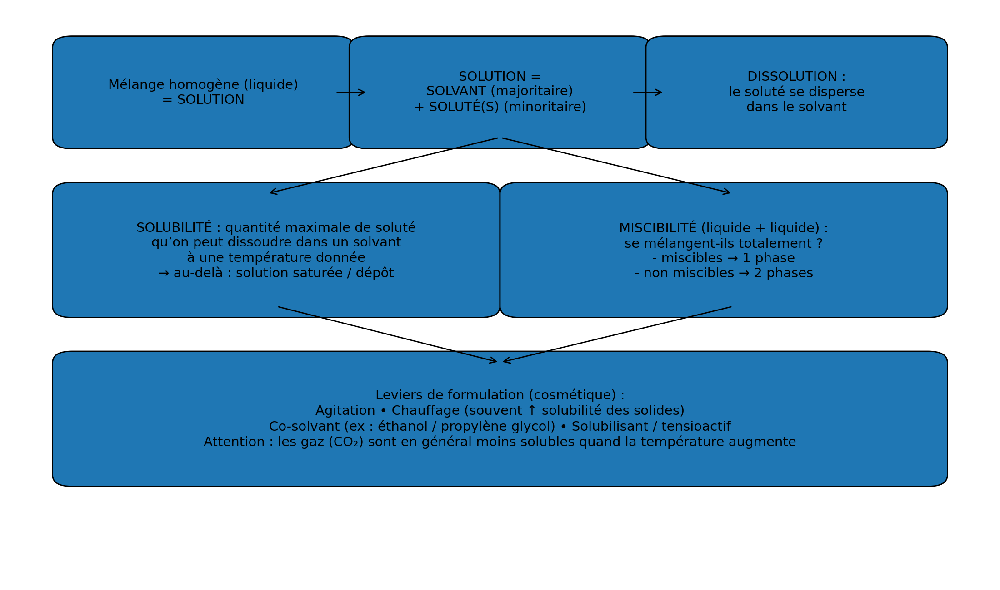

# S02 – Formuler une solution cosmétique stable 📖

**Solution – Solvant – Soluté – Dissolution – Solubilité – Miscibilité**

---

## 1️⃣ De mélange homogène à solution

Lors de la séance précédente, nous avons montré que certains produits cosmétiques (comme la lotion micellaire) sont des **mélanges homogènes** : on ne distingue pas les différents constituants à l'œil nu.

En chimie, un mélange homogène liquide porte un nom spécifique : c'est une **solution**.

---

## 2️⃣ Solution, solvant et soluté

### 🔹 Solution

**Définition**

Une **solution** est un **mélange homogène** constitué :
- d'un **solvant** (constituant majoritaire),
- d'un ou plusieurs **solutés** (constituants minoritaires dissous).

**Exemples cosmétiques**
- Lotion micellaire
- Eau tonique
- Sérum aqueux

---

### 🔹 Solvant

**Définition**

Le **solvant** est le constituant **majoritaire** d'une solution. C'est lui qui dissout les autres substances.

**Exemples**
- **Eau** (solvant le plus courant en cosmétique)
- Éthanol
- Huile (pour les produits lipophiles)

---

### 🔹 Soluté

**Définition**

Le **soluté** est une substance **dissoute dans le solvant**, présente en plus faible quantité.

Un soluté peut être :
- un **solide** (sel, sucre, poudre d'actif...)
- un **liquide** (glycérine, parfum hydrosoluble...)
- un **gaz** (CO₂ dans l'eau gazeuse)

**Exemples cosmétiques**
- Glycérine (humectant)
- Acide hyaluronique (actif)
- Conservateurs
- Parfum

---

### 🔹 Schéma récapitulatif

```
┌─────────────────────────────────────────────────────────────┐
│                        SOLUTION                             │
│                  (mélange homogène)                         │
│                                                             │
│    ┌──────────────┐         ┌──────────────────────────┐    │
│    │   SOLVANT    │    +    │        SOLUTÉ(S)         │    │
│    │ (majoritaire)│         │    (minoritaires)        │    │
│    │              │         │                          │    │
│    │  Ex : Eau    │         │  Ex : Glycérine, actifs  │    │
│    └──────────────┘         └──────────────────────────┘    │
└─────────────────────────────────────────────────────────────┘
```

{.img-center width="95%"}


---

## 3️⃣ La dissolution

### 🔹 Définition

La **dissolution** est le processus par lequel un **soluté** se disperse de manière homogène dans un **solvant** pour former une **solution**.

### 🔹 Ce qui se passe au niveau microscopique

Lors de la dissolution :
1. Les particules de soluté (molécules ou ions) se **séparent** les unes des autres
2. Elles se **dispersent** parmi les molécules de solvant
3. Le mélange devient **homogène**

📌 **Important** : Le soluté ne disparaît pas ! Il est toujours présent dans la solution, simplement dispersé. On peut le récupérer par évaporation du solvant.

### 🔹 Dissolution ≠ Fusion

| Dissolution | Fusion |
|-------------|--------|
| Dispersion d'un soluté dans un solvant | Changement d'état solide → liquide |
| Nécessite un solvant | Nécessite de la chaleur |
| Le soluté reste à l'état solide (dispersé) | Le solide devient liquide |
| Ex : sel dans l'eau | Ex : glace qui fond |

❌ On ne dit pas "le sucre fond dans le café" mais "le sucre **se dissout** dans le café".

---

## 4️⃣ La solubilité

### 🔹 Définition

La **solubilité** est la **quantité maximale** de soluté que l'on peut dissoudre dans un volume donné de solvant, à une température donnée.

Elle s'exprime généralement en **g/L** ou **g/100 mL**.

### 🔹 Exemple

La solubilité du chlorure de sodium (sel) dans l'eau est de **360 g/L à 25°C**.

Cela signifie qu'on peut dissoudre au maximum 360 g de sel dans 1 L d'eau à 25°C. Au-delà, le sel ne se dissout plus et forme un **dépôt** au fond : la solution est **saturée**.

---

### 🔹 Facteurs influençant la solubilité

| Facteur | Influence | Exemple |
|---------|-----------|---------|
| **Température** | ↑ Généralement, la solubilité **augmente** quand la température augmente | La caféine : 20 g/L à 25°C → 180 g/L à 60°C |
| **Nature du solvant** | Un soluté n'a pas la même solubilité dans tous les solvants | L'acide hyaluronique : soluble dans l'eau, insoluble dans l'huile |
| **Nature du soluté** | Chaque substance a sa propre solubilité | Le sel : 360 g/L ; le glucose : 910 g/L |

### 🔹 Règle qualitative : "Le semblable dissout le semblable"

- Les substances **polaires** (hydrophiles) se dissolvent dans les solvants **polaires** (eau)
- Les substances **apolaires** (lipophiles) se dissolvent dans les solvants **apolaires** (huile)

| Type de substance | Soluble dans l'eau | Soluble dans l'huile |
|-------------------|:------------------:|:--------------------:|
| Hydrophile (polaire) | ✅ Oui | ❌ Non |
| Lipophile (apolaire) | ❌ Non | ✅ Oui |

---

## 5️⃣ La miscibilité

### 🔹 Définition

La **miscibilité** concerne le mélange de **deux liquides**.

Deux liquides sont **miscibles** s'ils peuvent se mélanger pour former un **mélange homogène** (une seule phase).

Deux liquides sont **non miscibles** s'ils forment un **mélange hétérogène** (deux phases distinctes).

### 🔹 Exemples

| Liquide 1 | Liquide 2 | Résultat | Conclusion |
|-----------|-----------|----------|------------|
| Eau | Éthanol | 1 phase | **Miscibles** |
| Eau | Glycérine | 1 phase | **Miscibles** |
| Eau | Huile | 2 phases | **Non miscibles** |

### 🔹 Miscibilité vs Solubilité

| | Solubilité | Miscibilité |
|---|------------|-------------|
| **Concerne** | Un solide (ou gaz) dans un liquide | Deux liquides |
| **Question** | "Ce solide peut-il se dissoudre ?" | "Ces deux liquides peuvent-ils se mélanger ?" |
| **Exemple** | Le sel est soluble dans l'eau | L'eau et l'éthanol sont miscibles |

---

## 6️⃣ Stabilité d'une solution cosmétique

### 🔹 Définition

Une solution cosmétique est dite **stable** si elle **reste homogène dans le temps**.

### 🔹 Signes d'instabilité

Une solution instable peut présenter :
- Un **dépôt** (précipité au fond)
- Un **trouble** (aspect laiteux)
- Une **séparation de phases** (deux couches)
- Des **cristaux** visibles

### 🔹 Causes d'instabilité

| Cause | Explication | Solution |
|-------|-------------|----------|
| **Dépassement de solubilité** | Trop de soluté par rapport à la limite | Réduire la concentration |
| **Baisse de température** | La solubilité diminue, le soluté précipite | Stocker à température adaptée |
| **Incompatibilité solvant/soluté** | Le soluté n'est pas soluble dans ce solvant | Changer de solvant ou ajouter un co-solvant |
| **Non miscibilité** | Deux liquides non miscibles | Ajouter un tensioactif ou faire une émulsion |

### 🔹 Phrase clé

> 📌 **Une solution cosmétique stable, c'est un mélange homogène qui reste homogène dans le temps.**

---

## 7️⃣ Méthode BTS : décrire une solution

Pour décrire scientifiquement une solution cosmétique :

1. **Identifier** le type de mélange (homogène → solution)
2. **Nommer** le solvant (constituant majoritaire)
3. **Lister** les principaux solutés
4. **Vérifier** la compatibilité solvant/solutés (solubilité)
5. **Conclure** sur la stabilité attendue

---

## 8️⃣ À retenir pour l'épreuve E2

### ✅ Définitions clés

| Terme | Définition courte |
|-------|-------------------|
| **Solution** | Mélange homogène (solvant + soluté(s)) |
| **Solvant** | Constituant majoritaire |
| **Soluté** | Constituant minoritaire dissous |
| **Dissolution** | Dispersion du soluté dans le solvant |
| **Solubilité** | Quantité maximale de soluté qu'on peut dissoudre |
| **Miscibilité** | Capacité de deux liquides à se mélanger |

### ✅ Facteurs de solubilité

1. **Température** (↑T° → ↑solubilité en général)
2. **Nature du solvant** (eau ≠ huile ≠ éthanol)
3. **Nature du soluté** (chaque substance a sa propre solubilité)
4. **Cas des gaz** : la solubilité des gaz **diminue souvent quand la température augmente** et **augmente quand la pression augmente** (ex : CO₂).


### ✅ Vocabulaire à maîtriser

- Solution / Solvant / Soluté
- Dissolution / Solubilité / Saturation
- Miscible / Non miscible
- Stable / Instable / Dépôt / Précipité

### ✅ Erreur classique à éviter

| ❌ Erreur | ✅ Correction |
|----------|--------------|
| "Le sucre fond dans l'eau" | "Le sucre **se dissout** dans l'eau" |
| "L'huile n'est pas soluble dans l'eau" | "L'huile et l'eau ne sont pas **miscibles**" |

---

## 🔗 Lien avec la suite de la progression

Dans la **séance suivante (S03)**, nous apprendrons à **quantifier** une solution :

- **Concentration massique** (Cm en g/L)
- **Quantité de matière** (n en mol)
- Interprétation d'une concentration dans un contexte professionnel

---

## 🔧 Outils méthodologiques associés

➡️ [**Fiche méthode 01 – Justifier une réponse en physique-chimie**](https://bts-mecp-physique-chimie-688080.forge.apps.education.fr/Methodologie/01_fiche_methode/)
