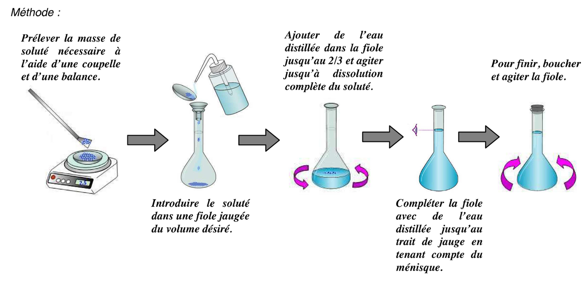
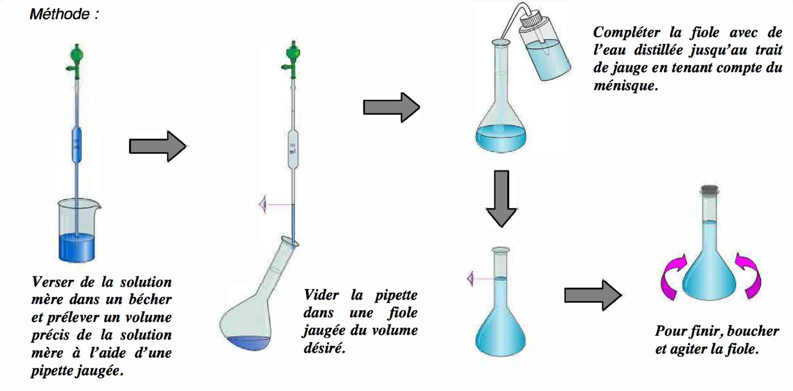

# S05 – TP1 : Dissolution, dilution, échelle de teinte 🔬

**Préparation de solutions – Dilution – Exploitation visuelle**

> En BTS MECP, l'exploitation d'un TP doit être **rigoureuse**, **justifiée** et faire le lien avec le **contexte professionnel**.

---

## 🎯 Objectifs du TP

À l'issue de ce TP, vous serez capables de :

* **Préparer** une solution par dissolution (solution mère)
* **Réaliser** des dilutions pour obtenir une gamme de concentrations
* **Utiliser** une échelle de teinte pour estimer une concentration
* **Exploiter** les résultats avec rigueur scientifique
* **Rédiger** un compte-rendu de TP structuré

---

## 🧴 Pourquoi c'est important pour votre métier ?

En laboratoire cosmétique, vous serez amené(e) à :

* **Préparer des solutions d'actifs** ou de matières premières à des concentrations précises
* **Réaliser des dilutions** pour obtenir des concentrations adaptées
* **Contrôler la concentration** d'un produit par comparaison visuelle ou instrumentale
* **Préparer des solutions de référence** pour effectuer des contrôles
* **Documenter vos manipulations** de façon rigoureuse (traçabilité)
* **Respecter les protocoles** pour garantir la reproductibilité
* **Vérifier la conformité** d'un produit par rapport à un cahier des charges

Dans ce TP, nous utiliserons du **sulfate de cuivre(II) pentahydraté CuSO₄·5H₂O**.

Sa coloration bleue permet de visualiser facilement les différences de concentration.

> 💡 *Le sulfate de cuivre est utilisé ici comme **modèle expérimental d'une espèce colorée**. Le TP reproduit la démarche générale d'un contrôle qualité, mais la solution utilisée n'est pas une véritable formulation cosmétique.*

👉 **Ce TP vous permettra** de maîtriser les gestes de base en préparation de solutions et de comprendre comment une gamme étalon peut être utilisée pour contrôler un produit.

---

## 🧴 Situation professionnelle

Vous travaillez au **laboratoire de contrôle qualité** d'une entreprise cosmétique.

Un lot de **lotion colorée** vient d'être produit. Vous devez vérifier que la concentration de l'espèce colorée respecte le cahier des charges.

Pour des raisons pratiques de laboratoire, la lotion cosmétique réelle est ici **simulée par une solution aqueuse de sulfate de cuivre(II) pentahydraté CuSO₄·5H₂O**.

Le sulfate de cuivre constitue donc dans ce TP un **modèle expérimental d'un produit coloré**.

Le cahier des charges simulé impose une concentration massique comprise entre :

$$
\boxed{40\ \text{g/L} \leq C \leq 60\ \text{g/L}}
$$

Pour cela, vous allez :

1. Préparer une **solution mère** de sulfate de cuivre(II) pentahydraté par dissolution
2. Préparer une **gamme étalon** par dilutions successives
3. Comparer visuellement la **lotion simulée inconnue** à la gamme étalon
4. Estimer sa concentration
5. Conclure sur sa conformité au cahier des charges

---

## 📋 Matériel disponible

### Verrerie

* Fioles jaugées : 100 mL, 50 mL
* Pipettes jaugées : 2 mL, 5 mL, 10 mL, 20 mL
* Bécher 250 mL, 100 mL (x6)
* Tubes à essai identiques
* Portoir à tubes
* Pissette d'eau distillée
* Pipette Pasteur ou compte-gouttes
* Propipette ou poire d'aspiration

### Produits

* **Sulfate de cuivre(II) pentahydraté CuSO₄·5H₂O**
* Eau distillée
* **Lotion colorée simulée inconnue** constituée d'une solution de CuSO₄·5H₂O

### Instruments

* Balance de précision (±0,01 g)
* Spatule
* Feutre

---

## ⚠️ Consignes de sécurité

| Pictogramme | Précaution                                                                                       |
| :---------: | ------------------------------------------------------------------------------------------------ |
|      🥼     | Porter une **blouse de laboratoire**                                                             |
|      🥽     | Porter des **lunettes de protection**                                                            |
|      🧤     | Porter des **gants** pendant la manipulation                                                     |
|      🚫     | Ne jamais pipeter à la bouche : utiliser une **propipette**                                      |
|      🚿     | En cas de contact cutané, rincer abondamment à l'eau                                             |
|     👁️     | En cas de projection dans les yeux, rincer immédiatement et prévenir l'enseignant                |
|      ♻️     | Les solutions contenant des ions cuivre **Cu²⁺ doivent être récupérées dans le récipient prévu** |

> ⚠️ Le sulfate de cuivre(II) pentahydraté est un **réactif chimique de laboratoire**. Il ne doit pas être ingéré et les solutions contenant du cuivre ne doivent pas être rejetées directement dans l'environnement.

---

# PARTIE A – Préparation de la solution mère par dissolution

## A.1 – Objectif

Préparer **100 mL** d'une solution mère de sulfate de cuivre(II) pentahydraté à :

$$
\boxed{C_m = 100\ \text{g/L}}
$$

---

## A.2 – Calcul préliminaire

**Quelle masse de sulfate de cuivre(II) pentahydraté faut-il peser ?**

Données :

* Volume souhaité : V = 100 mL = _______ L
* Concentration souhaitée : Cm = 100 g/L

Calcul :

$$
m = C_m \times V = ......... \times ......... = ......... \text{ g}
$$

Conclusion :

Il faut peser :

$$
\boxed{.........\ \text{g de CuSO₄·5H₂O}}
$$

---

## A.3 – Protocole de dissolution

Réalisez les étapes suivantes et cochez au fur et à mesure :

| Étape | Action                                                                                       | ✓ |
| :---: | -------------------------------------------------------------------------------------------- | - |
|   1   | Vérifier que le bécher destiné à la pesée est propre et sec                                  | ☐ |
|   2   | Tarer la balance avec le bécher                                                              | ☐ |
|   3   | Peser environ _______ g de CuSO₄·5H₂O                                                        | ☐ |
|   4   | Noter la masse réellement pesée : m = _______ g                                              | ☐ |
|   5   | Transférer quantitativement le sulfate de cuivre dans la fiole jaugée de 100 mL              | ☐ |
|   6   | Rincer le bécher et verser l'eau de rinçage dans la fiole                                    | ☐ |
|   7   | Ajouter de l'eau distillée jusqu'au 2/3 de la fiole                                          | ☐ |
|   8   | Agiter jusqu'à dissolution complète des cristaux                                             | ☐ |
|   9   | Compléter progressivement avec de l'eau distillée jusqu'au trait de jauge                    | ☐ |
|   10  | Terminer goutte à goutte si nécessaire                                                       | ☐ |
|   11  | Boucher et homogénéiser (retourner environ 10 fois)                                          | ☐ |
|   12  | Transvaser une partie de la solution dans un bécher de 250 mL pour réaliser les prélèvements | ☐ |
|   13  | Étiqueter : **« Solution mère CuSO₄·5H₂O – environ 100 g/L »**                               | ☐ |




---

## A.4 – Concentration réelle de la solution mère

Si la masse réellement pesée est différente de la masse calculée, recalculez la concentration réelle :

$$
C_{m,\text{réelle}} = \frac{m_{\text{pesée}}}{V}
= \frac{.........}{0,100}
= ......... \text{ g/L}
$$

### Comparaison avec la valeur théorique

Votre concentration réelle est-elle proche de 100 g/L ?

☐ Oui

☐ Non

Justifiez brièvement :

..................................................................................................................

..................................................................................................................

📌 **Pour la suite du TP, nous utiliserons \(C_m = 100\ \text{g/L}\) comme valeur de travail afin d'utiliser les pipettes jaugées disponibles.**

> La concentration réelle calculée permet néanmoins d'évaluer la qualité de votre préparation.

---

# PARTIE B – Préparation de la gamme étalon par dilution

## B.1 – Objectif

Préparer 5 solutions filles de concentrations décroissantes à partir de la solution mère.

| Solution | Concentration souhaitée (Cf) | Volume final (Vf) |
| :------: | :--------------------------: | :---------------: |
|    S1    |            60 g/L            |       50 mL       |
|    S2    |            40 g/L            |       50 mL       |
|    S3    |            20 g/L            |       50 mL       |
|    S4    |            10 g/L            |       50 mL       |
|    S5    |             4 g/L            |       50 mL       |

---

## B.2 – Calculs préliminaires

Pour chaque solution fille, calculez le volume \(V_m\) de solution mère à prélever.

Lors d'une dilution :

$$
C_m \times V_m = C_f \times V_f
$$

Donc :

$$
V_m = \frac{C_f \times V_f}{C_m}
$$

avec :

$$
C_m = 100\ \text{g/L}
$$

| Solution | Cf (g/L) | Vf (mL) | Calcul                 | Vm (mL) |
| :------: | :------: | :-----: | ---------------------- | :-----: |
|    S1    |    60    |    50   | Vm = (60 × 50) / 100 = |         |
|    S2    |    40    |    50   | Vm = (40 × 50) / 100 = |         |
|    S3    |    20    |    50   | Vm = (20 × 50) / 100 = |         |
|    S4    |    10    |    50   | Vm = (10 × 50) / 100 = |         |
|    S5    |     4    |    50   | Vm = (4 × 50) / 100 =  |         |

---

## B.3 – Vérification par le facteur de dilution

Le facteur de dilution peut être déterminé de deux façons :

$$
F = \frac{C_m}{C_f}
$$

et :

$$
F = \frac{V_f}{V_m}
$$

Complétez le tableau pour vérifier vos calculs :

| Solution |     F = Cm/Cf    |     F = Vf/Vm    |  Cohérent ? |
| :------: | :--------------: | :--------------: | :---------: |
|    S1    | **100/60 = ___** | 50/ **_ _ _ = _ _ _** | ☐ Oui ☐ Non |
|    S2    | **100/40 = ___** | 50/ **_ _ _ = _ _ _** | ☐ Oui ☐ Non |
|    S3    | **100/20 = ___** | 50/ **_ _ _ = _ _ _** | ☐ Oui ☐ Non |
|    S4    | **100/10 = ___** | 50/ **_ _ _ = _ _ _** | ☐ Oui ☐ Non |
|    S5    |  **100/4 = ___** | 50/ **_ _ _ = _ _ _** | ☐ Oui ☐ Non |

---

## B.4 – Protocole de dilution (pour chaque solution)

Pour chaque solution S1 à S5, réalisez :

| Étape | Action                                                                 | ✓ |
| :---: | ---------------------------------------------------------------------- | - |
|   1   | Choisir la pipette jaugée adaptée au volume Vm                         | ☐ |
|   2   | Installer la propipette sur la pipette jaugée                          | ☐ |
|   3   | Prélever Vm mL de solution mère en faisant attention au trait de jauge | ☐ |
|   4   | Verser le prélèvement dans une fiole jaugée de 50 mL                   | ☐ |
|   5   | Ajouter de l'eau distillée jusqu'à environ 2/3 de la fiole             | ☐ |
|   6   | Agiter légèrement                                                      | ☐ |
|   7   | Compléter avec de l'eau distillée jusqu'au trait de jauge              | ☐ |
|   8   | Boucher et homogénéiser par plusieurs retournements                    | ☐ |
|   9   | Transvaser dans un bécher de 100 mL                                    | ☐ |
|   10  | Étiqueter (S1, S2... avec la concentration correspondante)             | ☐ |



---

## B.5 – Choix de la verrerie

Pour chaque volume à prélever, indiquez la pipette jaugée utilisée :

| Solution | Vm (mL) | Pipette utilisée     |
| :------: | :-----: | -------------------- |
|    S1    |         | Pipette(s) de ___ mL |
|    S2    |         | Pipette de ___ mL    |
|    S3    |         | Pipette de ___ mL    |
|    S4    |         | Pipette de ___ mL    |
|    S5    |         | Pipette de ___ mL    |

> 💡 Pour S1, plusieurs prélèvements peuvent être nécessaires avec les pipettes disponibles.

---

## B.6 – Résultat : votre gamme étalon

Une fois les 5 solutions préparées, versez un **même volume** de chaque solution dans des tubes à essai identiques.

Disposez-les dans l'ordre croissant de concentration :

```text
     S5         S4         S3         S2         S1        Mère
    4 g/L      10 g/L     20 g/L     40 g/L     60 g/L    100 g/L
      │          │          │          │          │          │
      ▼          ▼          ▼          ▼          ▼          ▼
   ┌─────┐    ┌─────┐    ┌─────┐    ┌─────┐    ┌─────┐    ┌─────┐
   │     │    │     │    │     │    │     │    │     │    │     │
   │     │    │     │    │     │    │     │    │     │    │     │
   │     │    │     │    │     │    │     │    │     │    │     │
   └─────┘    └─────┘    └─────┘    └─────┘    └─────┘    └─────┘

    Couleur plus claire ◄─────────────────────────────► Couleur plus intense
```

### Observation

Comment évolue l'intensité de la coloration bleue lorsque la concentration en sulfate de cuivre augmente ?

..................................................................................................................

..................................................................................................................

📸 **Prenez une photo de votre gamme étalon**

---

# PARTIE C – Détermination de la concentration de la lotion inconnue

## C.1 – Objectif

Estimer la concentration en sulfate de cuivre(II) pentahydraté de la **lotion colorée simulée inconnue** en la comparant à la gamme étalon.

---

## C.2 – Manipulation

1. Verser un peu de lotion inconnue dans un **tube à essai identique à ceux utilisés pour la gamme**.

2. Verser approximativement le même volume que dans les tubes étalons.

3. Placer ce tube à côté de la gamme étalon.

4. Observer les solutions sur un **fond blanc**.

5. Déplacer si nécessaire le tube inconnu le long de la gamme.

6. Comparer les intensités de coloration.

---

## C.3 – Observation

La lotion inconnue a une couleur qui se situe :

☐ Entre S5 (4 g/L) et S4 (10 g/L)

☐ Entre S4 (10 g/L) et S3 (20 g/L)

☐ Entre S3 (20 g/L) et S2 (40 g/L)

☐ Entre S2 (40 g/L) et S1 (60 g/L)

☐ Entre S1 (60 g/L) et la solution mère (100 g/L)

☐ Plus claire que S5 (< 4 g/L)

☐ Plus intense que la solution mère (> 100 g/L)

---

## C.4 – Estimation de la concentration

### Étape 1 – Encadrement

D'après votre observation :

$$
.........\ \text{g/L} < C_{\text{inconnue}} < .........\ \text{g/L}
$$

### Étape 2 – Estimation

Si la coloration semble intermédiaire entre les deux solutions qui l'encadrent, estimez la concentration :

$$
C_{\text{inconnue}} \approx ......... \text{ g/L}
$$

> 📌 L'échelle de teinte est une méthode **semi-quantitative** : elle permet surtout d'encadrer la concentration. La valeur estimée reste approximative.

---

## C.5 – Vérification de conformité

Le cahier des charges impose une concentration entre :

$$
\boxed{40\ \text{g/L et }60\ \text{g/L}}
$$

1. La concentration estimée (_______ g/L) est-elle dans l'intervalle [40 ; 60] g/L ?

☐ Oui, la lotion est **conforme**

☐ Non, la lotion est **non conforme**

2. Si non conforme, la concentration est :

☐ Trop faible (< 40 g/L)

☐ Trop élevée (> 60 g/L)

### Justifiez votre conclusion :

..................................................................................................................

..................................................................................................................

---

# PARTIE D – Exploitation et compte-rendu

## D.1 – Questions d'exploitation

### Question 1 – Précision de la méthode

La méthode de l'échelle de teinte permet-elle une mesure précise de la concentration ? Justifiez en 2-3 lignes.

<br><br><br><br>

### Question 2 – Sources d'erreur

Citez **trois sources d'erreur** possibles lors de ce TP :

1. ---

2. ---

3. ---

### Question 3 – Amélioration de la méthode

Quelle méthode instrumentale permettrait une mesure plus précise de la concentration ?

**Indice : vous l'étudierez plus tard dans votre progression.**

<br><br><br>

### Question 4 – Lien avec le métier

En quoi ce TP est-il représentatif d'une démarche de travail en laboratoire de contrôle qualité cosmétique ?

Pensez notamment :

* à la préparation de références ;
* au respect d'un protocole ;
* à la comparaison d'un produit à un cahier des charges ;
* à la traçabilité.

Répondez en 3-4 lignes.

<br><br><br><br>

---

## D.2 – Synthèse du TP (bilan personnel)

> 🎯 **Compétence E2 : Communiquer**

Rédigez un **bilan de TP** en 6-8 lignes qui présente :

* L'objectif du TP
* La méthode utilisée (**dissolution + dilution + comparaison**)
* La gamme étalon préparée
* Le résultat obtenu (**encadrement et estimation de la concentration de la lotion inconnue**)
* La conclusion sur la conformité
* Une limite éventuelle de la méthode utilisée

<br><br><br><br><br><br><br><br>

---

## 🏆 Mes réussites aujourd'hui

**Cochez ce que vous avez réussi à faire :**

| Réussite                                                                | ✓ |
| ----------------------------------------------------------------------- | - |
| J'ai préparé une solution par dissolution (pesée + ajustement au trait) | ☐ |
| J'ai calculé la concentration réelle de ma solution mère                | ☐ |
| J'ai calculé correctement les volumes à prélever pour les dilutions     | ☐ |
| J'ai vérifié mes calculs avec le facteur de dilution                    | ☐ |
| J'ai choisi la verrerie adaptée aux volumes à prélever                  | ☐ |
| J'ai réalisé les dilutions avec la verrerie adaptée                     | ☐ |
| J'ai constitué une gamme étalon                                         | ☐ |
| J'ai su utiliser l'échelle de teinte pour encadrer une concentration    | ☐ |
| J'ai estimé la concentration de la solution inconnue                    | ☐ |
| J'ai conclu sur sa conformité au cahier des charges                     | ☐ |
| J'ai respecté les consignes de sécurité et de gestion des déchets       | ☐ |
| J'ai rédigé un bilan de TP structuré                                    | ☐ |

💡 **Bravo !** Ce TP vous a permis de mettre en pratique toutes les notions de S02, S03 et S04.

---

## ✅ Auto-évaluation du TP

| Critère                                                                    | Note /4 |
| -------------------------------------------------------------------------- | :-----: |
| **Manipulation** : gestes précis, respect du protocole                     |         |
| **Calculs** : résultats justifiés, unités correctes, vérification par F    |         |
| **Observation** : comparaison rigoureuse avec la gamme                     |         |
| **Exploitation** : questions traitées, conclusion justifiée, bilan rédigé  |         |
| **Attitude** : sécurité, gestion des déchets, rangement, travail en équipe |         |

---

## 🔗 Pour la suite de la progression

Dans les **séances suivantes**, vous découvrirez :

* **S07** : La masse volumique (autre propriété mesurable)
* **S09** : Le pH (contrôle de l'acidité)
* **S23 (TP4)** : CMC par conductimétrie (gamme de concentrations de tensioactif)
* **S25** : Absorbance et Beer-Lambert (exploitation de spectres et gammes étalon sur documents)

---

## 🔧 Outils méthodologiques associés

➡️ [**Fiche méthode 02 – Calculer et interpréter une concentration**](https://bts-mecp-physique-chimie-688080.forge.apps.education.fr/Methodologie/02_fiche_methode/)

➡️ [**Fiche méthode 03 – Exploiter un TP à l'écrit**](https://bts-mecp-physique-chimie-688080.forge.apps.education.fr/Methodologie/03_fiche_methode/)

➡️ [**Fiche méthode 04 – Choisir et justifier une dilution**](https://bts-mecp-physique-chimie-688080.forge.apps.education.fr/Methodologie/04_fiche_methode/)
